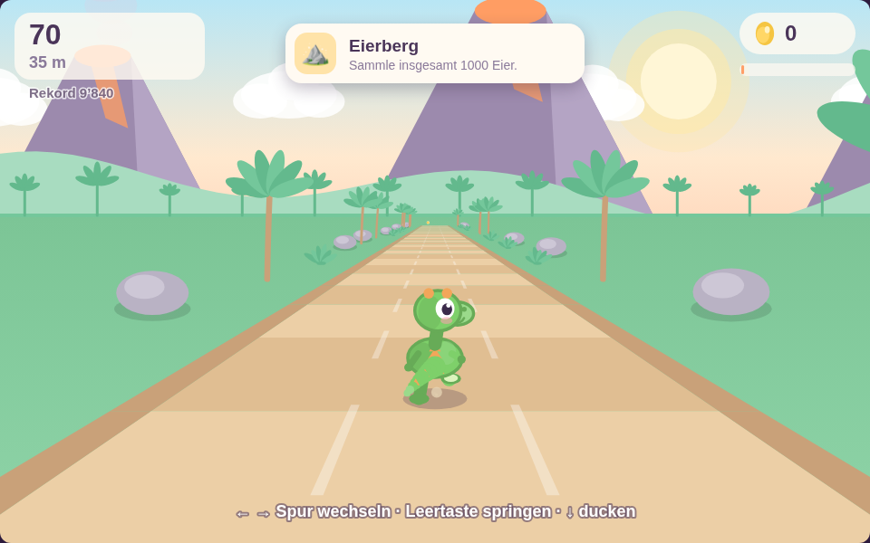
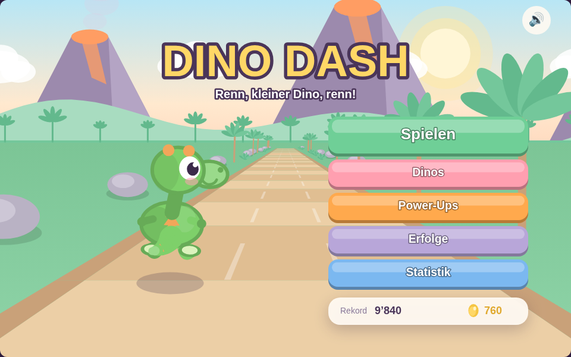

# 🦕 Dino Dash

Ein Endless-Runner im Stil von Subway Surfers – nur mit einem süssen Cartoon-Dino,
der über einen prähistorischen Dschungelpfad rennt. Drei Spuren, Vulkane am
Horizont, goldene Dino-Eier statt Münzen.

Läuft komplett im Browser, ohne Backend und ohne eine einzige Asset-Datei: Der
Dino, die Umgebung und sämtliche Soundeffekte werden zur Laufzeit erzeugt.





## Schnellstart

```bash
npm install
npm run dev      # Entwicklungsserver auf http://localhost:5173
npm run build    # Typecheck + Produktions-Build nach dist/
npm run preview  # gebautes Spiel lokal ansehen
npm test         # Browser-Tests (Playwright)
```

Beim ersten Mal muss Playwright noch den Browser holen:

```bash
npx playwright install chromium
```

## Ohne Installation spielen

`release/dino-dash.html` enthält das komplette Spiel in einer einzigen Datei —
herunterladen, doppelklicken, fertig. Kein Node.js, kein Server, keine
Internetverbindung nötig; auch der Highscore wird ganz normal gespeichert.

Neu erzeugen lässt sie sich mit:

```bash
npm run build:single
```

Der normale `dist/`-Build funktioniert per Doppelklick übrigens **nicht**:
Browser verweigern das Laden externer ES-Module über `file://`. Deshalb bettet
`scripts/build-singlefile.mjs` das JavaScript direkt in die HTML-Datei ein —
ein Inline-Modul muss nichts nachladen.

## Steuerung

| Aktion | Tastatur | Touch |
| --- | --- | --- |
| Spur nach links | `←` oder `A` | nach links wischen |
| Spur nach rechts | `→` oder `D` | nach rechts wischen |
| Springen | `Leertaste`, `↑` oder `W` | nach oben wischen |
| Ducken / Rutschen | `↓` oder `S` | nach unten wischen |
| Pause | `P` oder `Esc` | – |
| Menü bestätigen | `Enter` | tippen |

Ducken funktioniert auch mitten im Sprung – der Dino sackt dann schnell nach
unten durch.

## Spielprinzip

Der Dino rennt von allein und wird mit der Zeit immer schneller (14 → 44 m/s).
Die Abstände zwischen den Hindernissen wachsen dabei mit, gemessen aber nicht in
Metern, sondern in **Reaktionszeit**: Sie schrumpft von 1,75 s auf 1,05 s. Das
Spiel wird also schneller, ohne unfair zu werden.

### Hindernisse

| Hindernis | Lösung |
| --- | --- |
| 🪨 Felsbrocken | springen oder ausweichen |
| 🪵 Baumstamm | springen |
| 🌿 Hängender Ast | ducken |
| 🦖 Anderer Dino | zu hoch zum Springen – Spur wechseln |
| 🌋 Lavaspalte | springen (oft über zwei Spuren) |

Welche Aktion hilft, ergibt sich direkt aus der Geometrie: Jedes Hindernis hat
eine vertikale Ausdehnung, und die Kollision prüft, ob sich die Box des Dinos
mit ihr überschneidet. Der Ast beginnt oberhalb der Duckhöhe, der Baumstamm
endet unterhalb der Sprunghöhe.

## Bonus-Features

- **Goldene Dino-Eier** als Sammelobjekte, teils in Sprungbögen über Hindernissen.
- **Power-Ups**
  - 🧲 **Magnet** (8 s) – zieht Eier im Umkreis an
  - 🛡️ **Schild** (9 s) – überlebt einen Treffer und räumt das Hindernis weg
  - ⚡ **Tempo-Boost** (6 s) – 55 % schneller, 50 % mehr Punkte
  - 🪀 **Sprungfeder** (12 s) – erlaubt einen Doppelsprung
- **Streckenabschnitte**: Alle 750 m wechselt die Umgebung – Dschungeltag, Abendglut,
  Sternennacht mit Mond und Sternenhimmel, Morgengrauen. Die Paletten blenden über
  160 m ineinander, ein Banner nennt den neuen Abschnitt.
- **Power-Up-Upgrades** gegen Eier: drei Stufen je Power-Up (200/450/900 Eier), die
  die Wirkdauer verlängern. Damit behalten Eier auch nach allen Skins einen Nutzen.
- **Highscore und Fortschritt** in `localStorage` (Rekord, beste Strecke, Eier-Konto,
  Top-5-Bestenliste).
- **Statistikseite** mit Läufen, Bestwerten und den fünf besten Läufen.
- **7 freischaltbare Dino-Skins** gegen gesammelte Eier: Rex (gratis), Beere (60),
  Wölkchen (150), Sonnenschein (300), Minze (500), Schattenpfote (800),
  Regenbogen (1500).
- **9 Erfolge**, z. B. „50 Eier in einem Lauf" oder „Überlebe einen Treffer mit
  dem Schild". Sie werden **während** des Laufs geprüft, erscheinen also im Moment
  des Erreichens statt erst nach dem Game Over.
- **Soundeffekte** komplett über die Web Audio API synthetisiert (Sprung,
  Sammeln, Power-Up, Treffer, Game Over). Stummschalten über das Lautsprecher-
  Symbol im Hauptmenü.
- **Rücksicht auf Systemeinstellungen**: Bei aktivem `prefers-reduced-motion`
  entfällt das Bildschirmwackeln.
- **Automatische Pause**, sobald das Fenster den Fokus verliert – ein
  versehentliches Alt-Tab kostet keinen Lauf mehr.

## Tests

61 Browser-Tests mit Playwright, die das echte Spiel in Chromium steuern:

```bash
npm test              # alle Tests headless
npm run test:headed   # mit sichtbarem Browser zuschauen
npm run test:ui       # interaktiver Playwright-UI-Modus
```

| Datei | Deckt ab |
| --- | --- |
| `tests/smoke.spec.ts` | Laden ohne Konsolenfehler, Canvas-Auflösung und Skalierung, Lauf startet und schreitet fort |
| `tests/controls.spec.ts` | Spurwechsel und Begrenzung, Sprung, Ducken, Mid-Air-Slam, Swipe-Gesten, Pause |
| `tests/collision.spec.ts` | Jedes Hindernis mit der richtigen *und* der falschen Reaktion, Game Over, Neustart |
| `tests/collectibles.spec.ts` | Ei-Aufnahme, Magnet-Anziehung, alle vier Power-Ups, Doppelsprung, Schild-Rettung |
| `tests/progression.spec.ts` | `localStorage`-Persistenz, Skin-Kauf, Menü-Navigation, Erfolge |
| `tests/upgrades.spec.ts` | Power-Up-Upgrades, Bestenliste, Erfolge während des Laufs, Biome, Auto-Pause |

### Wie die Tests deterministisch bleiben

Das Spiel ist von Natur aus zufällig – ein Test, der auf ein zufällig gespawntes
Hindernis wartet, wäre unbrauchbar. Deshalb greifen die Tests über einen
Dev-Hook (`window.dinoDash`, nur unter `import.meta.env.DEV`, im Produktions-Build
nachweislich entfernt – das prüft `smoke.spec.ts` gegen `dist/`) auf die laufende
Szene zu: Sie leeren den Pfad, stoppen den Spawner und platzieren genau ein
Hindernis in definierter Entfernung.

Diese Entfernung wird in **Sekunden Vorlauf** angegeben, nicht in Metern – so
bleibt ein Test bei geänderter Geschwindigkeit gültig.

Zeitkritische Übergänge wie der 0,15 s kurze Spurwechsel werden **innerhalb der
Seite** Bild für Bild abgetastet (`sampleAfterKey`), weil ein Round-Trip über den
Testrunner sie überspringen kann.

Die Suite wurde per Mutationstest gegengeprüft: Wird die Kollisionserkennung
deaktiviert, fallen exakt die 7 „muss krachen"-Tests und keiner der
„muss überleben"-Tests. Wird die Duckhöhe entfernt, fallen exakt die 2 Tests,
die das Ducken abdecken.

## Automatisierung

Zwei GitHub-Actions-Workflows liegen unter `.github/workflows/`:

- **`ci.yml`** – prüft bei jedem Push und jedem Pull Request Typen, Build,
  alle Browsertests und den Single-File-Build.
- **`pages.yml`** – veröffentlicht das Spiel bei jedem Push auf `main` über
  GitHub Pages. Einmalig nötig: in den Repository-Einstellungen unter *Pages*
  die Quelle auf *GitHub Actions* stellen.

## Architektur

### Warum kein Framework?

Phaser 3 (~1,2 MB) und Kaboom.js bringen vor allem eine Asset-Pipeline, Arcade-
Physik und Sprite-Atlanten mit – genau das, was dieses Projekt nicht braucht:

- Es gibt **keine Asset-Dateien**. Der Dino ist eine prozedurale Vektorzeichnung,
  Skins sind nur ausgetauschte Farbpaletten.
- Die **Physik** ist ein einziger Gravitationswert plus eine Sprunggeschwindigkeit.
- Der Subway-Surfers-Look lebt von einer **Pseudo-3D-Perspektivprojektion**: Jedes
  Objekt hat eine Tiefe `z` und wird über `FOCAL / z` auf den Bildschirm projiziert.
  Diese Projektion müsste man in Phaser ohnehin selbst schreiben – dort aber
  gegen die eingebaute 2D-Kamera.

Ergebnis: **null Runtime-Dependencies**, ~50 KB Bundle (18 KB gzip), und volle
Kontrolle über die Zeichenreihenfolge, die für die Tiefenwirkung entscheidend ist.

### Koordinatensystem

Der Ursprung liegt in der Kamera. `z` ist die Entfernung nach vorn, `y` die Höhe
über dem Pfad, `x` die Seitwärtsachse. Die drei Spuren liegen bei
`x = -2,2 / 0 / +2,2`. Der Dino steht fix bei `z = 7`; alles andere bewegt sich
auf ihn zu. Gezeichnet wird nach `z` absteigend sortiert, damit Nahes Fernes
überdeckt.

### Ordnerstruktur

```
src/
├── core/         Konfiguration, Mathematik, Eingabe (Tastatur + Swipe), Typen
├── assets/       Prozedurale Grafik: Dino-Zeichnung und Skin-Paletten
├── entities/     Spieler, Hindernisse, Eier, Power-Ups (Daten + Darstellung)
├── systems/      Spawner, Kollision, Audio, Speicherung, Erfolge, Partikel
├── render/       Projektion, Zeichenhilfen, Biome, Parallax-Hintergrund, Pfad, HUD, UI
├── scenes/       Menü, Spiel, Dino-Auswahl, Power-Ups, Erfolge, Statistik
├── game.ts       Spielschleife, Szenenverwaltung, Speicherstand
└── main.ts       Canvas-Setup und Skalierung

tests/            Playwright-Browsertests plus gemeinsame Helfer
```

Die Trennung folgt der Frage „wie oft ändert sich das?": `core/` und `render/`
sind stabile Infrastruktur, `entities/` und `systems/` enthalten die Spielregeln,
`scenes/` verdrahtet beides zu Bildschirmen.

### Darstellung

Gerendert wird immer in eine feste interne Auflösung von 960 × 600, die per CSS
auf das Fenster skaliert wird. Dadurch muss kein Layout-Code die Fenstergrösse
berücksichtigen, und Zeigerpositionen lassen sich mit einer einzigen
Umrechnung auf Spielkoordinaten abbilden.

Der Hintergrund besteht aus sechs Parallax-Ebenen (Himmel, Sonne, Wolken,
Vulkane, Hügel, Baumreihe), die sich unterschiedlich schnell bewegen. Pfad und
Randbewuchs entstehen dagegen aus derselben Projektion wie die Spielobjekte und
scrollen deshalb automatisch korrekt mit.
